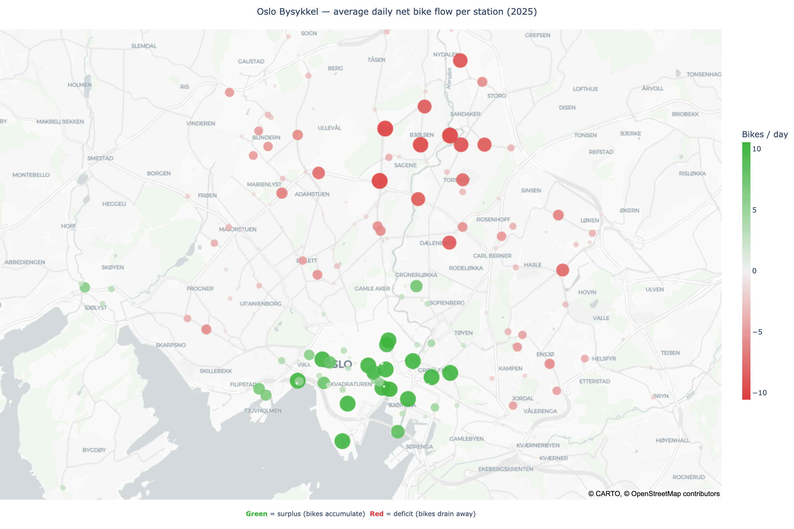

# Oslo Bysykkel Forecast

Oslo's bike sharing system, [Bysykkel](https://oslo.bysykkel.no/en), has a rebalancing problem.

Users tend to ride bikes *downhill*: from the surrounding neighbourhoods into the city centre, and use other transport to get home. This creates a predictable daily imbalance: central stations fill up with surplus bikes that need to be transported away, while uphill stations drain of bikes and need to be restocked.


*Average daily net bike flow per station (2025). Green = surplus (bikes accumulate); red = deficit (bikes drain away). The downhill drift towards the city centre is clearly visible. — [interactive version](https://bysykkelforecast.streamlit.app)*

Rebalancing fleets of bikes across the city is expensive. The further in advance Bysykkel can anticipate demand, the better they can plan logistics: fewer emergency runs, lower costs, better service availability for users.

**This tool predicts the total number of Bysykkel trips up to 9 days ahead**, using simple machine learning models and live weather forecasts from MET Norway. A GitHub Actions workflow runs every morning to update predictions automatically, no manual intervention needed. The most up-to-date forecast is visualised here: [forecast dashboard](https://bysykkelforecast.streamlit.app). 

---

## How it works

**1. Data** (`01_data_exploration.ipynb`)  
Five years of Bysykkel trip data (2021–2025) are merged with hourly weather observations from Oslo Blindern and explored for seasonal patterns and weather correlations.

**2. Model** (`02_model.ipynb`)  
XGBoost models are trained on engineered features: cyclical time encodings, weather lags, holiday indicators... Two separate models are trained: one for week day hours (Mon–Fri) and one for weekends; and evaluated with time-series cross-validation. Final test MAE: ~12 trips/hour.

**3. Forecast** (`03_forecast.ipynb`)  
The trained models are applied to a 9-day hourly weather forecast fetched from the [MET Norway Locationforecast 2.0 API](https://api.met.no/) for Blindern (lat 59.9423, lon 10.7200).

**4. Station mapping** (`04_station_mapping.ipynb`)  
Each station's historical net flow (arrivals − departures) is computed from 2025 trip data and used to map where bikes tend to accumulate and drain. A simple scaling method estimates the daily surplus or deficit at each station from a system-level trip count (future work: can be used to translate the forecast to net flow per station). 

**5. Dashboard** (`dashboard/`)  
A Streamlit dashboard visualises the trip forecast alongside temperature and precipitation. A GitHub Actions workflow (`update_forecast.yml`) re-runs the forecast script every morning and commits the new CSV automatically.

---

## Repository structure

```
├── 01_data_exploration.ipynb   # data loading, merging, correlation analysis
├── 02_model.ipynb              # feature engineering, training, evaluation
├── 03_forecast.ipynb           # generate and visualise a 9-day forecast
├── 04_station_mapping.ipynb    # per-station net flow map and scaling model
├── input/                      # raw trip + weather data (see input/README.md)
├── output/
│   ├── model_weekday.joblib    # trained XGBoost model (Mon–Fri)
│   ├── model_weekend.joblib    # trained XGBoost model (Sat–Sun)
│   ├── station_surplus_deficit.html  # interactive surplus/deficit map
│   ├── station_surplus_deficit.png   # static surplus/deficit map
│   └── forecasts/              # forecast CSVs updated daily through GitHub Actions
└── dashboard/
    ├── dashboard.py            # Streamlit dashboard
    ├── bysykkel_forecast.py    # forecast script (called by GitHub Actions)
    └── requirements.txt
```

---

## Running locally

```bash
pip install -r dashboard/requirements.txt

# Generate a forecast
python dashboard/bysykkel_forecast.py

# Launch the dashboard
streamlit run dashboard/dashboard.py
```

To reproduce the full pipeline from raw data, place your input files in `input/` as described in [`input/README.md`](input/README.md), then run the notebooks in order.

---

## Data sources

- **Trip data:** [Oslo Bysykkel open data](https://oslo.bysykkel.no/en/open-data)
- **Weather observations:** [Seklima (MET Norway)](https://seklima.met.no) (station 18700, Oslo Blindern)
- **Weather forecast:** [MET Norway Locationforecast 2.0](https://api.met.no/)

---

## Disclaimer

This is an independent hobby project and is not affiliated with, endorsed by, or in any way connected to Oslo Bysykkel or its operators. Trip forecasts are generated by a machine learning model trained on historical data and are subject to important limitations. Forecasts are provided for informational purposes only. No responsibility is taken for the accuracy, completeness, or timeliness of the forecasts. Use at your own discretion. 

---

## License

This project is licensed under the [GNU General Public License v3.0](LICENSE).